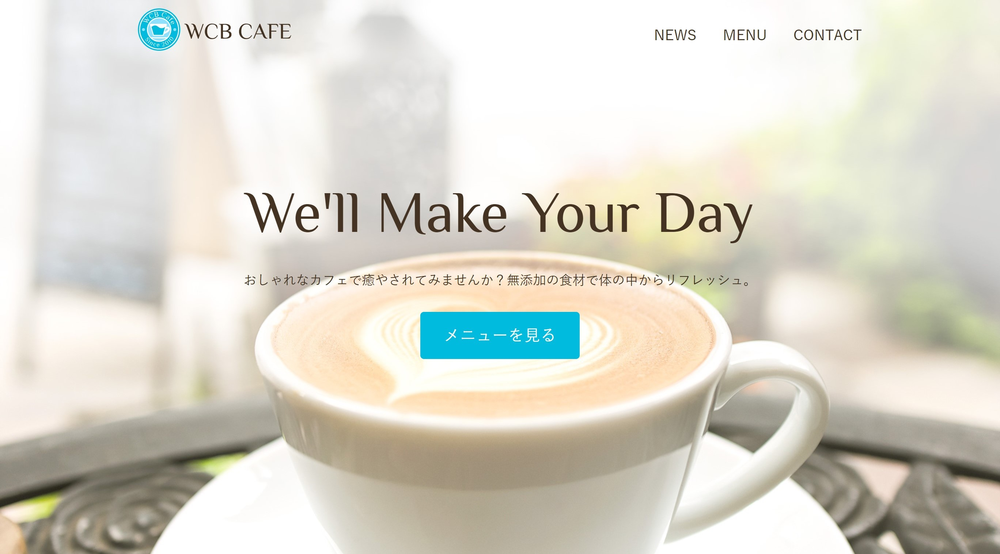
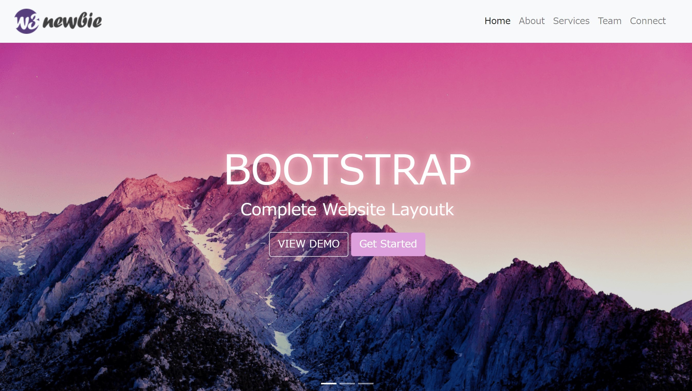
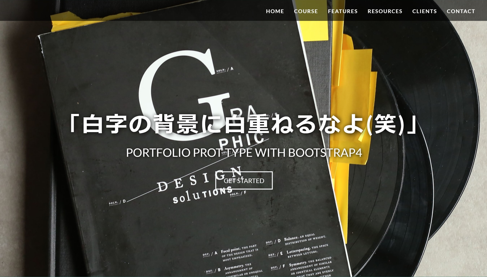

<!doctype html>
<html lang="ja">
  <head>
    <!-- Required meta tags -->
    <meta charset="utf-8">
    <meta name="viewport" content="width=device-width, initial-scale=1, shrink-to-fit=no">

    <!-- Bootstrap CSS -->
    <link rel="stylesheet" href="https://stackpath.bootstrapcdn.com/bootstrap/4.2.1/css/bootstrap.min.css" integrity="sha384-GJzZqFGwb1QTTN6wy59ffF1BuGJpLSa9DkKMp0DgiMDm4iYMj70gZWKYbI706tWS" crossorigin="anonymous">
    <link rel="stylesheet" href="style.css">
    <link href="https://fonts.googleapis.com/earlyaccess/nicomoji.css" rel="stylesheet">
    <title>しさくひん第一号</title>
  </head>
  <body>
  
  
<!-- section header -->
<section class="header">
  <header>
    <nav class="navbar fixed-top navbar-light">
      
    <button class="navbar-toggler" type="button" data-toggle="collapse" data-target="#navbarResponsive">
      
    </button>

    

      <ul class="navbar-nav">
        <li class="nav-item"><a href="" class="nav-link">ああ</a></li>
        <li class="nav-item"><a href="" class="nav-link">あああ</a></li>
        <li class="nav-item"></li>
        <li class="nav-item"></li>
      </ul>
    

    </nav> 
  </header>
</section><!--End section header -->

<!-- Start top page Section -->
<section class="top-page">

      

        <h1 class="page-title text-center">試作品第一号</h1>

 

</section><!-- End top page Section -->

<section class="main">
  

    

  

    

    

      
      <h2 class="sub-title">あまりにも暇だから。</h2>
      
ただでさえ暇で愚鈍な大学生なので、何かやってみようと、たまたまyoutubeで見たhtmlとcssでコーディングしてみた。
        詳しい人がいたら連絡してほしいです。メンター的な人が一人でもほしい
      

    

  

  

    

      <h2 class="sub-title text-center">つくったもの。</h2>
      
本を読んだり、youtubeで動画を見たり。だらだら作ってみました。
      

      

        

          

            
            

              <h4 class="card-title text-center">存在しないカフェのサイト</h4>
              
本を見ながら作った

				    	<a name="" id="" class="btn btn-secondary" href="sample-cafe/" role="button">もっとみる</a>
            

          
  
        

        

          

            
            

              <h4 class="card-title text-center">存在しない講座のサイト</h4>
              
動画を見ながら作った

				    	<a name="" id="" class="btn btn-secondary" href="sample1/" role="button">もっとみる</a>
            

          
  
        

        

          

            
            

              <h4 class="card-title text-center">存在しない講座のサイト</h4>
              
動画を見ながら作った

				    	<a name="" id="" class="btn btn-secondary" href="sample2" role="button">もっとみる</a>
            

          
  
        

       
         
         
存在しないものばかり作っているね

       

        
        
      

    

    

    

      <h2 class="sub-title">作るにあたって学んだもの</h2>
      
html＆css＆bootstrap4
      

      
html:サイトを作る骨組みとなる言語。簡単な配置を決めることができるよ

    
      
css :htmlを装飾するための言語。色や大きさを決めるよ

      
      
Bootstrap4:よく使うhtmlとcssのコマンドを引き出すための道具箱

    

  

</section><!-- End main Section -->

         
  
adove Xdもちょっとやったよ

  

    <h2 class="sub-title">学習教材</h2>
    
1.書籍「1冊ですべて身につくHTML＆CSSとWebデザイン入門講座」
    

    
2.オンライン学習サイト「ドットインストール」のbootstrap入門
    

    
3.youtubeのbootstrapを使ったホームページ作成の動画2本
    

   
  

  

         
  
1~3をやってサイトを作るまでに約20日かかったよ

  

    <h2 class="sub-title text-center">ふりかえって</h2>
    <ul class="text-center">
      <li class="mb-4">デバイスによって表示形式を変える必要があるのだが、
        今回は疲れたので断念した。</li>
      <li class="mb-4">フォントと画像の種類や大きさ、配置など
        何も決めずに書き始めたので煩雑なコードになった。</li>
      <li>コードが煩雑過ぎて修正がめんどくさくて放棄してしまった。</li>
    </ul>
   
  

  

    <h1 class="text-center">次はもう少し見通しよくきれいに書く  </h1>
  

    

    <!-- Optional JavaScript -->
    <!-- jQuery first, then Popper.js, then Bootstrap JS -->
    
    
    
  </body>
  </html>
